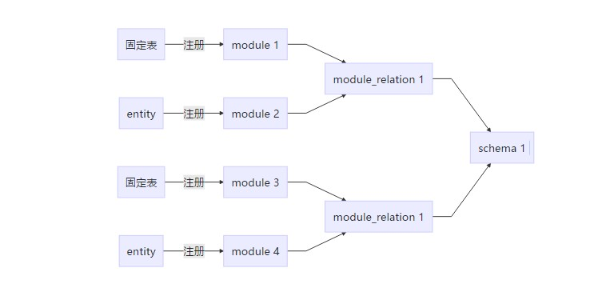
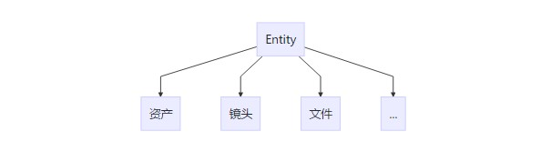

# Strack 4.0 影视动画游戏流程管理系统

[](https://secure.php.net/)
[](https://github.com/walkor/Workerman)
[](https://github.com/cgpipline/strack/blob/master/LICENSE)

# 缘起

当前 strack 版本基于开源版本 strack3.0 继续维护。

本人从2016年-2019年作为strack核心开发人员，因为公司财务问题导致 strack3.0 实际上没有得到完全商业化就夭折甚是可惜，故重启此维护版本回馈行业。

# 维护人员

 姓名 | 简介 | 联系方式
---|---|---
weijer | PMC | 微信 weijer（备注：github strack）
mychenjun | committer

# 更新计划

- [x] 整理优化代码
- [x] event和消息异步处理
- [x] 底层框架漏洞修复
- [x] PHP版本兼容升级 7.4
- [x] 重写media服务
- [x] 重写log服务
- [x] 编写一键部署文件
- [ ] 黑盒功能性测试
- [x] 编写使用文档
- [ ] 增加demo项目
- [ ] 整理 python api sdk 代码
- [ ] 整理 python event 代码
- [ ] 重写 PYQT client 客户端
- [ ] 增加 Minio + Filetash 自建网盘管理外包文件
- [ ] 对接 Rocket.Chat
- [ ] 支持workerman高性能运行（改动太大看情况）

# 架构图


# 底层模块数据结构

一般简单业务系统开发都是先从业务流程出发，抽象数据结构建库建表，表是固定的。为了适应复杂业务模型，对表做了局部动态处理。

## 涉及表及其关系

|表名|说明
|---|---
|fixed| 固定表
|entity | 实体表
|module | 模块注册表，可以动态注册 entity 实体类
|module_relation | 模块关系描述表
|schema | 由多个模块关系组成一个特定的数据结构




## Entity表

Entity表为动态表，可以由此注册实例化多个动态模块



## 最小结构单元

一个Entity可以理解成一组任务分组模块，一个Entity必然对应一个Base（任务表）。


# docker-compose 一键部署

**脚本下载地址**

[https://github.com/cgpipline/strack-install](https://github.com/cgpipline/strack-install)

下载本仓库代码到自己服务器，进入strack-install根目录

|命令|说明|
|---|---|
|./run.sh install| 全新安装strack，一键安装过了会卸载重新安装|
|./run.sh update| 同步strack最新仓库代码，更新strack|
|./run.sh uninstall| 卸载strack|

## 1. 环境要求

这部分自行安装解决

|环境|说明
|---|---
|Linux系统| 推荐使用 centos7+（RockyLinux8）或者 Ubuntu18+
|docker | 容器
|docker-compose | 容器编排工具

## 2. 下载一键安装脚本到上面准备好的服务器

```shell

# 打开 run.sh
# 如果使用域名端口号需要自行处理

LOCAL_HOSTNAME=改成当前服务器外网ip或者域名
WS_HOSTNAME=改成当前服务器外网ip或者域名

# 进入到 strack-install 根目录执行

# 赋予执行权限
chmod -R 777 ./run.sh

# 执行安装
./run.sh install

# 安装提示done之后此时服务并没有完全正常启动
# 服务之间会等待依赖服务完全启动才会进入 ready 状态
# 整个过程大约 3-5 分钟

# 默认访问地址

http://你的服务器ip:19801

# 或者

http://你的域名:19801（端口号自行处理）
```

## 3. 默认账户

|名称| 值
|---|---
|管理员账户 | strack
|管理员密码  | strack

|名称| 值
|---|---
|组长账户 | demo1
|组长密码  | strack@Demo

|名称| 值
|---|---
|组员账户 | demo2
|组员密码  | strack@Demo

|名称| 值
|---|---
|组员账户 | demo3
|组员密码  | strack@Demo

# 学习路线图

你可以参考我们给你列出的学习路线，对自己的学习有一个规划。

## IT的学习路线图

[1.快速上手-IT篇](https://github.com/cgpipline/strack/wiki/1.-快速上手#21快速上手-it篇)

[2.strack使用逻辑](https://github.com/cgpipline/strack/wiki/2.-通用使用逻辑)

[3.IT管理者手册](https://github.com/cgpipline/strack/wiki/4.-IT管理者手册)

## 制片/协调的学习路线图

[1.快速上手-制片/协调篇](https://github.com/cgpipline/strack/wiki/1.-快速上手#22快速上手-制片协调篇)

[2.strack使用逻辑-网页端](https://github.com/cgpipline/strack/wiki/2.-通用使用逻辑)

[3.使用者手册-制片/协调篇](https://github.com/cgpipline/strack/wiki/3.-用户手册#41使用者手册-制片协调篇)

## 客户（导演）/总监的学习路线图

[1.快速上手-客户（导演）/总监篇](https://github.com/cgpipline/strack/wiki/1.-快速上手#23快速上手-客户导演总监篇)

## 艺术家/组长的学习路线图

[1.快速上手-艺术家/组长-网页篇](https://github.com/cgpipline/strack/wiki/1.-快速上手#24快速上手-艺术家组长-网页篇)

[2.快速上手-艺术家/组长-客户端篇](https://github.com/cgpipline/strack/wiki/1.-快速上手#25快速上手-艺术家组长-客户端篇)

[3.strack使用逻辑-客户端](https://github.com/cgpipline/strack/wiki/2.-通用使用逻辑#35strack使用逻辑-客户端)

[4.使用者手册-艺术家/组长篇](https://github.com/cgpipline/strack/wiki/3.-用户手册#43使用者手册-艺术家组长篇)

## TD的学习路线图

[1.快速上手-IT篇](https://github.com/cgpipline/strack/wiki/1.-快速上手#21快速上手-it篇)

[2.strack使用逻辑](https://github.com/cgpipline/strack/wiki/2.-通用使用逻辑)

[3.TD开发者手册](https://github.com/cgpipline/strack/wiki/5.-TD开发者手册)
