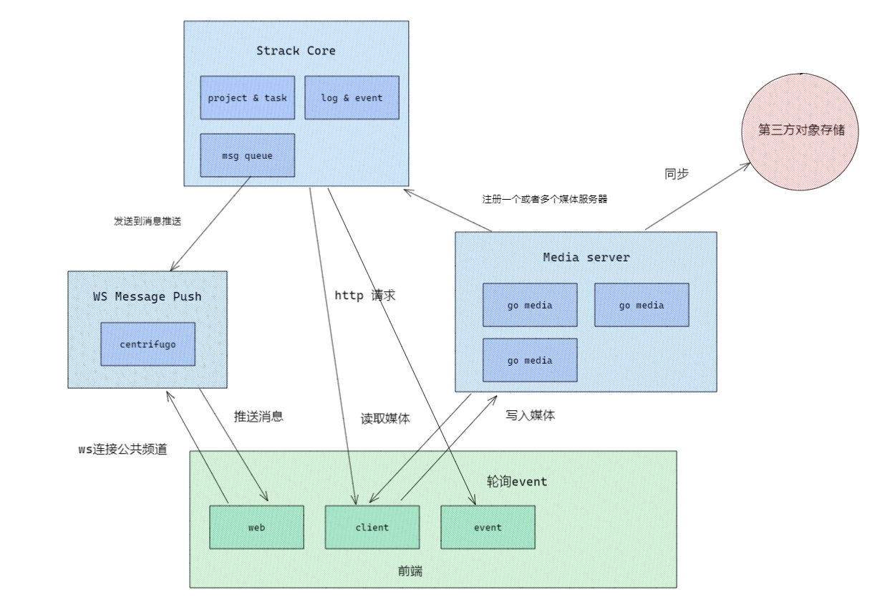

# Strack 4.0 影视动画游戏流程管理系统

[](https://secure.php.net/)
[](https://github.com/walkor/Workerman)
[](https://github.com/cgpipline/strack/blob/master/LICENSE)

# 缘起

当前 strack 版本基于开源版本 strack3.0 继续维护。

本人从2016年-2019年作为strack核心开发人员，因为公司财务问题导致 strack3.0 实际上没有得到完全商业化就夭折甚是可惜，故重启此维护版本回馈行业。

# 维护人员

 姓名 | 简介 | 联系方式
---|---|---
weijer | PMC | 微信 weijer（备注：github strack）
mychenjun | committer

# 更新计划

- [x] 整理优化代码
- [x] event和消息异步处理
- [x] 底层框架漏洞修复
- [x] PHP版本兼容升级 7.4
- [x] 重写media服务
- [x] 重写log服务
- [x] 编写一键部署文件
- [ ] 黑盒功能性测试
- [ ] 编写使用文档
- [ ] 整理 python api sdk 代码
- [ ] 整理 python event 代码
- [ ] 重写 PYQT client 客户端
- [ ] 对接 Rocket.Chat
- [ ] 支持workerman高性能运行（改动太大看情况）

# 架构图



# 安装

## 1. 自己准备一台干净的linux操作系统

```shell
# centos 安装docker 和 docker-compose 案例

# 更新系统
yum update

# 使用yum安装docker
yum -y install docker

# 启动
systemctl start docker.service

# 设置为开机自启动
systemctl enable docker.service

# 下载docker-compose
sudo curl -L "https://github.com/docker/compose/releases/download/1.23.2/docker-compose-$(uname -s)-$(uname -m)" -o /usr/local/bin/docker-compose

# 添加可执行权限(这里不懂可以看一下菜鸟教程-linux教程-文件权限)
sudo chmod +x /usr/local/bin/docker-compose

# 查看docker-compose版本
docker-compose --version

```

## 2. 下载一键安装脚本到上面准备好的服务器

```shell
# 脚本下载地址
https://github.com/cgpipline/strack-install

# 进入到strack-install根目录执行
chmod -R 777 ./install.sh
./install.sh

```


